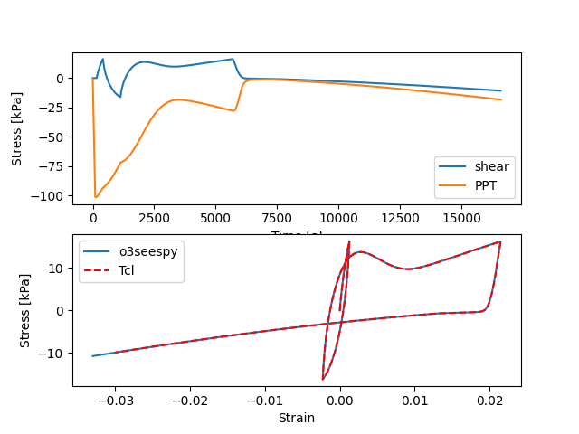

# Validation of the implementation of the pM4Sand element test

The o3seespy package is used to replicate the Tcl example from Geotechnical Eng Group, L. Chen, P. Arduino - Feb 2018
 
Tcl example found here: https://opensees.berkeley.edu/wiki/index.php/PM4Sand-Example_2 

