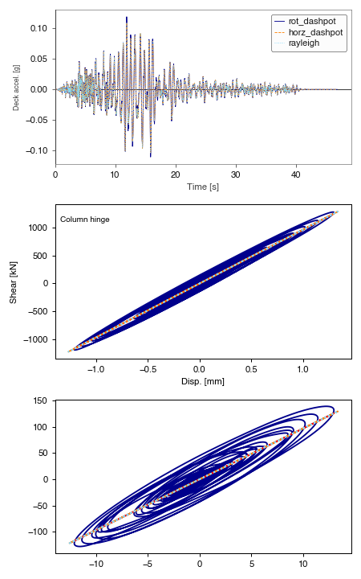

# Evaluation of Different damping options for SDOF

This study looks at three different damping options and the recorder output.

* Rotational dashpot [used when modelling SSI]
* Horizontal dashpot
* Rayleigh damping

See script: fig_sdof_eval_diff_damping_options.py

